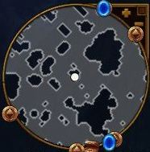

Quest (主线任务)
==============================================================================

.. contents::
    :depth: 1
    :local:

Act1 第一幕: Wake of the Alchemist 炼金术士的觉醒
------------------------------------------------------------------------------

.. contents::
    :depth: 1
    :local:

1.1 Warn the Estherians 警告伊斯瑞安人
~~~~~~~~~~~~~~~~~~~~~~~~~~~~~~~~~~~~~~~~~~~~~~~~~~~~~~~~~~~~~~~~~~~~~~~~~~~~~~

来到回音走廊，和前面的独眼大叔交谈，得知自己须孤身前往伊斯瑞安孤地，向那里的大执政官汇报，神秘的炼金术士摧毁了火炬之光一事。往东北离开哨所，沿途遭遇绳索、鼠人和战争巨兽。和前作一样，敌人名称的下边都注释其特点，敌人的颜色表示其强弱，红色是普通的敌人，粉色是强化敌人，而橙色则是Boss级别的。

杀怪会掉落装备，遇到宝箱、宝塔和尸体不妨搜索一下，或会开出不错的装备。装备分为灰、蓝、绿、金、暗金、橙几种颜色，对应着普通、魔法、稀有、唯一、传奇这些极别。

在货车旁遇到一名被困的守卫，帮他消灭两只鼠人，选一种装备作为奖励。地图上象这样的解救小任务很多，救人一命胜造七级浮屠，顺带赚点装备何乐而不为。往前杀乌姆斯林掉落粉色钥匙，用它可开启上锁的金色宝箱，拾取的宝石可镶嵌到有孔洞的装备上。

来到伊斯瑞安，这里的商人卖鉴定和传送两种卷轴，鉴定卷轴用来鉴定魔法装备。铁匠那里卖各种武器防具，中间的箱子用来储存道具。

见到大执政官老雷恩，得知那名炼金术士已经过来，杀戮了很多的守卫，并且给本地带来了一种极为罕见的疾病。指挥官威尔率人对他展开追击，希望能制止他造成更大的灾乱。

1.2 Protect the Guardian! 保护守护神！(lv12)
~~~~~~~~~~~~~~~~~~~~~~~~~~~~~~~~~~~~~~~~~~~~~~~~~~~~~~~~~~~~~~~~~~~~~~~~~~~~~~

指挥官威尔确信炼金术士会攻击泉源神殿，接近那里的水之守护神，主角于是赶往泉源神殿侦察那边的动静。此时广场开启传送门，旁边有名士兵的头顶有绿色的惊叹号，表示有支线任务可接，与之交谈接到支线“战兽武器库”。在广场还有洗点师，可以重置角色的技能点数。

前往先烈通道，这里徘徊着死灵系的怪物，骷髅战士、魔牙鬼、地狱行者等等，在路边的一座地穴前遇到米阿敏，交谈接到支线“阿莫-厄瑞克卷轴”。往东南行进到墓地，爬出一只会施放闪电法术的荆棘叮咬者，杀掉它沿山坡而下，往前来到神殿大草原。

大草原非常的辽阔，探索这里需要花费不少的时间。这里是熊人和鼠人的地盘，杀怪会掉落黄金钥匙，用来解锁黄金宝箱。在河边会遇到钓鱼点，不妨在这儿钓鱼玩玩，每个钓鱼点是有次数限制的，要能保证每次都钓上鱼或装备道具，诀窍是观察鱼钓附近的光圈，当它缩小并呈粉色时迅速提钩。钓上来的鱼可以喂给宠物，每种鱼都有不同的作用，比如隧道鲨能将宠物变成一只鼹鼠，有一定几率击晕敌人。网鱼能让宠物变成蜘蛛网缚敌人。

在地图会遇到技能专精神龛，它是用来暂时提升技能等级的，并减少魔法能量的消耗。在地图南部遇到一位可疑人物，交谈接到支线“死亡宣告”。

往地图的西北边找到神殿，里面充斥着手执长矛和护盾的盾卫，以及投掷魔法炸弹的巫师。继续往东南探索，是被幽灵附体的斯特姆熊人，遇到束缚光团优先解决。

进到地宫二层遇到粉怪夜晚践踏者，擅长毒和电属性攻击。先清杂兵，然后兜圈子磨死它。在地宫的西部有按钮机关，它们成对出现，用来变化通道上的屏障位置。前两组先按左边的按钮，然后找到第三组敲右边的拉杆。依次返回到第二组和第一组那里敲右边的按钮，进到屏障的深处找到三只宝箱。往地宫的北部杀粉色巫师，下到三层。

遭遇橙色怪物－格雷尔将军，先甩开他去清理杂兵，然后再去打将军，不要让他近身并小心捶地攻击，将自己的血量至少维持在三成左右。清完怪拿大宝箱，找指挥官威尔交谈，得知炼金术士袭击这里的细节。

1.3 Regroup at the Enclave 在伊斯瑞安集结
~~~~~~~~~~~~~~~~~~~~~~~~~~~~~~~~~~~~~~~~~~~~~~~~~~~~~~~~~~~~~~~~~~~~~~~~~~~~~~

和水系守护神对话，得知炼金术士患有灰烬枯萎病，为了治疗这种疾病而走向疯狂的边缘。他使用奥杜兰克之心的力量摧毁了火炬，需要吸收诸位守护神的力量来恢复心脏，每吸收一位守护神的能量，他的力量就强大几分。

和指挥官威尔返回到伊斯瑞安，威尔说大执政官已去往北方，为了预防伊斯瑞安人的瘟疫扩散，他会封锁守望原野的大门，这意味着神殿会成为瘟疫泛滥的重灾区。

1.4 Trail of the Grand Regent 大执政官的足迹
~~~~~~~~~~~~~~~~~~~~~~~~~~~~~~~~~~~~~~~~~~~~~~~~~~~~~~~~~~~~~~~~~~~~~~~~~~~~~~

和威尔再次对话，受托前往守望原野的神庙，由乌鸦小径到霜冻高原，在大执政官抵达神庙前追上他。

由北门出来到乌鸦小径，风声呜咽，雪花漫天飞卷，沿途都是些大小蜘蛛怪物和骷髅兵。在地图的西部有座洞窟，和女子贝雷恩交谈，接到支线任务“走失的小家伙”。 往地图的东部探索，杀掉一只粉怪通过桥梁，在这里见到老迈的伊斯瑞安长老瓦兰，他和大执政官走散了。

大执政官已经感染的瘟疫，必须在他感染到守护神之前阻止他。瓦兰希望使用避难所的传送门进入守望原野。可是激活传送门需要两把钥匙，一把被地精矿工偷走了，另一把在附近的奴隶主手里。

1.5 The Ember Keys 灰烬石之钥 (lv16)
~~~~~~~~~~~~~~~~~~~~~~~~~~~~~~~~~~~~~~~~~~~~~~~~~~~~~~~~~~~~~~~~~~~~~~~~~~~~~~

来到霜冻高原，有西南方的灰烬矿井和东北方的可去，访问顺序随意。在迷宫的北部有座庭院，正中是速度神龛，周围有四座小亭子，各有一只宝箱，其中一只是金色宝箱。在附近的石碑上钉着一名勇士，先清附近出现的骷髅兵，随后奥斯叮咬者复活。在霜冻高原的北方发现柳树林，调查石棺上的尸体会出现一只冥魔。在西北部杀掉几名强盗，拾取强盗钥匙，可用它开启旁边的箱子。

清理沿途的地精战士和弓手进到矿井，里面的地精砍杀者防御较强，甩开距离打，路上的红色木桶可以引爆，作为辅助杀敌手段。地精毁灭者会扔炸弹，要打一下就移位，炸到很快会挂掉。

矿井里会遇到附魔大师方铎，花费金币为身上的武器附魔，不过价格不菲，需要衡量再三。在以后的迷宫中还会遭遇附魔大师，他们的能力有所差异，最高可以将装备附魔到四级，比城镇里的附魔师要强，好好把握机会。

往迷宫的西北方杀地精工头，从宝箱里开出一把诅咒之剑，打败它随机拿到一件装备。找到Boss伯格王，攻击威猛凌厉，首先清掉场中所有的炸药桶，再首手清除杂兵，然后绕场游击，利用它行走迟缓的特点来磨死他，拾取灰烬石门钥匙。

往地图的东南方走，进到强盗营寨找到地窖－奴役者枷锁，里面多是黑手强盗，遭遇到一橙一粉两名强盗首领，杀掉他们拾取灰烬石门钥匙。进到牢房门释放两名囚犯来获取奖励。在西边的牢房里关着一名附魔师，释放他后，再到伊斯瑞安见他，是固定的附魔师。

带着两把钥匙前往避难所，将钥匙放到两侧石柱上，激活了前往守望原野的传送门。

1.6 Mission of Mercy 行善的任务 (lv20)
~~~~~~~~~~~~~~~~~~~~~~~~~~~~~~~~~~~~~~~~~~~~~~~~~~~~~~~~~~~~~~~~~~~~~~~~~~~~~~

来到守望原野神庙，前两层是中型迷宫，多是小虫子和会自爆的孢子植物，以及潮水般的虚空术士和奴役。在进入三层之前，建议穿戴回血装备，多备些药水。三层的中央是口深井，大执政官老雷恩从井里飘浮出来。战斗时离深井的边缘远一些，否则会遭到井里的触须抽打重击。沿着深井的外围游走，躲避地底穿刺的触须，还有老雷恩发射的蚯蚓状蓝色光束，伺机朝他回击。

打倒大执政官，和出现的自然守护神交谈，控制着大执政官的东西，也在试图控制守护神，它是冥界的魔王，炼金术士和它有所联系。话毕，从大宝箱里拿道具，经由传送门返回伊斯瑞安孤地。

1.7 Return to the Enclave 回到孤地
~~~~~~~~~~~~~~~~~~~~~~~~~~~~~~~~~~~~~~~~~~~~~~~~~~~~~~~~~~~~~~~~~~~~~~~~~~~~~~

在伊斯瑞安孤地和指挥官交谈，主角决定按照自然守护者所说，赶往奥西亚荒原阻止炼金术士利用奥兰杜克之心制造更大的祸乱。

1.8 Onward to Zeryphesh! 朝泽拉菲斯前进！
~~~~~~~~~~~~~~~~~~~~~~~~~~~~~~~~~~~~~~~~~~~~~~~~~~~~~~~~~~~~~~~~~~~~~~~~~~~~~~

在城中和铁匠旁边的帝国铁道大师交谈，乘坐列车穿越沙漠地带，来到泽拉菲斯城。

Act1 支线任务
------------------------------------------------------------------------------

.. contents::
    :depth: 1
    :local:

1.1 The Warbeast Armory 战兽武器库 (lv6)
~~~~~~~~~~~~~~~~~~~~~~~~~~~~~~~~~~~~~~~~~~~~~~~~~~~~~~~~~~~~~~~~~~~~~~~~~~~~~~

和伊斯瑞安的一名侦察兵交谈，他要主角前往神庙大草原，从斯特姆熊人的铁匠那里拿取盔甲草图。前往神殿大草原的东北部找到一片营地，清理那里的死亡射机和战卒，杀掉里端的两名铁匠，从木箱里拿到装备设计图。回到伊斯瑞安和侦察兵交谈，完成任务。

1.2 The Scroll of Anom Irek 阿莫-厄瑞克卷轴 (lv5)
~~~~~~~~~~~~~~~~~~~~~~~~~~~~~~~~~~~~~~~~~~~~~~~~~~~~~~~~~~~~~~~~~~~~~~~~~~~~~~

在先烈通道的地图上找到一处地穴，和地穴外边的女子米阿敏谈话，得知她被大执政官艾德里安指派到这里，拿取地穴里的阿莫-厄瑞克卷轴，不过地穴里有很多的斯特姆熊人，她无法深入到里边。

进入腐败地穴清理僵尸、骷髅兵、地狱行者和投斧战士。在怪物密集的地方，将怪物引出来分散消灭，避免被敌人包围。被打掉1/4的血量建议喝药水补满。绿色的软泥怪优先击破，其破裂所飞溅的酸液有腐蚀伤害。还要小心骷髅弓手，可以穿越障碍进行攻击，务必优先清除之。石棺和瓦罐都敲开看看，说不定有什么惊奇。迷宫的最东北角有只大宝箱，打开迷宫西北的一道木门，遭遇粉怪布克斯斯林，小心他的毒性攻击，拖远距离来打。继续往北部探索，沿石阶至下层。

杀掉几名骷髅将军，往南下行，遭遇几只冰系和电系伤害的蹒跚者，最后的Boss是粉怪墮落守护者，会释放三道电束。保持距离的话不难躲开，杀掉它掉落卷轴。回到地穴外和米阿敏交谈，结束任务。

1.3 Bring Out Your Dead 死亡宣告 (lv9)
~~~~~~~~~~~~~~~~~~~~~~~~~~~~~~~~~~~~~~~~~~~~~~~~~~~~~~~~~~~~~~~~~~~~~~~~~~~~~~

在神殿大草原的山丘旁遇到一个可疑人物，拜托主角进到骨色画廊来收集一个叫罗莎墨提斯的东西，有亡灵怪兽在守护着它。

在旁边的山丘上有道被幽灵锁链缚住的铁门，击破附近两道石碑释放伊斯瑞安人的幽灵，它们会将那道铁门打开。进到地窖遭遇粉怪吉尔萨克，杀掉它往前解决两只幽灵，解除幽灵锁链开宝箱。继续往北探索，在迷宫的最西端找到前往下一层的入口，附近有只会召唤蝙蝠的亡灵。

进到下层清理僵尸和骷髅士兵，经由传送点跳到一座巢穴，从井里爬出无数的小骷髅兵。与庞大身躯的默多克斯战斗，它只会近战和召唤，因此绕着井跑，躲避它呕吐喷溅的毒液，用远程攻击慢慢磨掉它的血量。战斗结束，上前拾取罗莎墨提斯，经由平台上的红色传送门回到地表，和可疑人物交谈结束任务。

1.4 Ghosts of Plunder Cove 劫掠海湾的灵魂 (lv11)
~~~~~~~~~~~~~~~~~~~~~~~~~~~~~~~~~~~~~~~~~~~~~~~~~~~~~~~~~~~~~~~~~~~~~~~~~~~~~~

在神殿大草原的河岸有一根灯柱，敲打灯笼后从河里漂来一只幽灵船，和幽灵欧尔文说话，他要主角帮忙报仇，当初杀他的人都藏在劫掠海湾。穿过传送门来到海湾，这里的怪物是海盗装的骷髅兵和幽灵，多用近战，少量的幽灵会远程攻击。遇到大群怪物的时候，可将它们引到入口的狭窄通道慢慢解决。

绕到海盗船上找到独眼威利，他会召唤成批的骷髅士兵，只会近战攻击，并且出手很容易判断和躲避。杀掉威利船长后，船头的两只宝箱解锁，拾取不少的药水。经由传送门回到岸边和欧尔文谈话，拿到装备奖励。

1.5 Little Lost Ones 走失的小家伙 (lv13)
~~~~~~~~~~~~~~~~~~~~~~~~~~~~~~~~~~~~~~~~~~~~~~~~~~~~~~~~~~~~~~~~~~~~~~~~~~~~~~

在乌鸦小径的西部见到哭泣的女子贝蕾思，得知她的宠物们跑到洞窟里了，丈夫费纳斯也跟在它们后面，她很是担心。进入洞窟－寡妇面纱，建议先装备抗毒性的道具，里边会遭遇会喷吐毒液的粉色大蜘蛛，解决掉它继续走，燃起火盆照亮前路。在迷宫的末端遇到白寡妇，一只硕大的白蜘蛛，它有两种攻击方式：仰起前身喷吐绿色毒液，朝身前冲撞扑击。保持在他的攻击和喷吐范围之外，游走攻击。

杀掉白寡妇，跑上斜坡见到费纳斯，所谓的宠物居然是两只蜘蛛。带着蜘蛛返回到贝蕾思那里，任务完成。注意，在寡妇面纱洞窟中，若点亮全部的21只火盆，在费纳斯身后有条秘密通道会开启，进去拾取机器线圈，接到支线“机器人零件”。

1.6 The Zeraphi Envoy 泽拉菲使节
~~~~~~~~~~~~~~~~~~~~~~~~~~~~~~~~~~~~~~~~~~~~~~~~~~~~~~~~~~~~~~~~~~~~~~~~~~~~~~

在霜冻高原的南部找到几辆残破的货车，遇到泽拉菲使节托蒂姆特和他的保镖，他们在征得大执政官老雷恩的同意，留在高原寻找黄金齿轮。他拜托主角帮忙收集三样东西：池塘纹饰、河流纹饰和潮汐纹饰，这三样东西的位置会在小地图上标注出来，分别过去开箱子。将三样东西交给使节，将它们组装在一起，确定黄金齿轮藏在附近的山洞里。

1.7 The Lost Key 丢失的钥匙
~~~~~~~~~~~~~~~~~~~~~~~~~~~~~~~~~~~~~~~~~~~~~~~~~~~~~~~~~~~~~~~~~~~~~~~~~~~~~~

泽拉菲使节拜托主角前往密语洞穴寻找黄金齿轮。进入洞穴，用范围攻击清掉滋生的虫子，从黄金箱子里拿到齿轮，回去找使节交差。

1.8 Taking Notes 拿取笔记 (lv17)
~~~~~~~~~~~~~~~~~~~~~~~~~~~~~~~~~~~~~~~~~~~~~~~~~~~~~~~~~~~~~~~~~~~~~~~~~~~~~~

在霜冻高原的南部见到杜贾科，受托前往冰封洞穴拿取三本炼金术士的笔记。洞穴由狭窄的通道和桥梁组成，循序渐进的打，避免陷入重围。迷宫中部进到二层极寒之蹄，建议穿戴冰抗高的装备，站在敌人的外围耐心的远程清扫。极寒之蹄是蛮牛状的怪物，它会冲撞和冰霜攻击，不要站到它的正面。杀掉它拾取万能钥匙，在附近收集三本笔记，里面写着为奥杜兰克之心充能的办法。回到外面找杜贾科交谈，他说炼金术士的疯狂中，似乎隐隐的藏着某种真相。

1.9 Robot Parts 机器人零件
~~~~~~~~~~~~~~~~~~~~~~~~~~~~~~~~~~~~~~~~~~~~~~~~~~~~~~~~~~~~~~~~~~~~~~~~~~~~~~

这是个较长的支线任务，需要在各幕中收集道具，它们都需要触发一定的条件，才能开启隐藏的小道找到。

机器人的第一部分在第一幕乌鸦小径的寡妇面纱洞窟中。须点亮所有的21只火盆，进密道拾取机器人线圈。

机器人的第二部分在第二幕奥西亚荒原的月光之塔，用手枪或火炮轰击墙壁上的四面铜锣，进到密道拾取机器人手臂。

机器人的第三部分在第二幕盐碱荒原的群聚点，地图西部找到繁殖巢穴，在洞中打碎所有的鸟蛋，在最里端拾取机器人管道。

机器人的第四部分在第三幕的被遗弃的锯木场，这里有很多被钉在墙壁和树上的骷髅，释放它们解锁一座小院，从中拿到机器人的身躯。

机器人的第五部分在第三幕的尖啸幽灵的领地，这里是毒气弥漫的沼泽地带，注意路边的树桩可以击破，摧毁场景中的所有树桩，可以打开地图右下边一条隐秘桥路，拾取机器人的头颅。

到第三幕的皇家营地找司杜科教授交谈，他将五个零件拼装起来，任务完成。和组装成的TB4000号交谈，接续任务“三姐妹”。

1.10 Phase Beast Challenge 相位兽的挑战
~~~~~~~~~~~~~~~~~~~~~~~~~~~~~~~~~~~~~~~~~~~~~~~~~~~~~~~~~~~~~~~~~~~~~~~~~~~~~~

在原野中遭遇到透明的位面野兽，杀掉它会出现一道传送门，进去完成挑战。这些副本可以反复刷经验、装备和金钱，杀完不从传送门退出，而是直接退出游戏重进。

挑战之一：相位兽在第一幕的神殿草原。在院子里看到术士在举行仪式，随后附近的巢穴里不断的涌现蜘蛛，先不要着急清理，迅速冲到正中的水碗里拿毒药瓶，将它倒进巢穴里，就不会再有蜘蛛爬出来。如此反复，将院子里所有的六个巢穴关闭。最后杀掉三只大蜘蛛，出现奖励宝箱。

挑战之二：相位兽在第一幕的霜冻高原。在中央的平台周围有四只火盆，按一定的顺序点燃四只火盆，顺序是随机的，需要自己尝试。正中平台出现冥魔，杀掉他暴出满院的金币，大致3000多。

挑战之三：相位兽在第二幕的奥西亚荒原。有几只大的史莱姆，它会不断的分裂出小史莱姆，并且自己有很高的回血技能。如果没有较高的伤害和攻击速度，是不容易杀死的。将所有的史莱姆杀死，三道平台上出现宝箱。

挑战之四：相位兽在第二幕的盐碱荒原。来到有沉船的地方，杀海盗收集沿途的大量金币。本关没有难度，主要是用来刷金钱和魔法卷轴。

Act2 第二幕: The Eve of War 战争前夜
------------------------------------------------------------------------------

2.1 The Eve of War 战争前夜
~~~~~~~~~~~~~~~~~~~~~~~~~~~~~~~~~~~~~~~~~~~~~~~~~~~~~~~~~~~~~~~~~~~~~~~~~~~~~~

**和空之守护神说话，得知炼金术士已来到奥西亚荒原，和艾泽若赫达成同盟。现在主角得前往被遗弃的地窖，抵御来自冥魔的威胁。**

来到阴暗的荒原，充斥着些老鼠、蜥蜴和穿甲兽，是艾泽若赫游牧民的地盘。穿甲兽绕到侧面和尾部攻击，会造成较大的伤害。在荒原的中部有只黄金宝箱，沙漠里还有几名遭劫持的旅人，消灭附近的艾泽若赫民兵和豺狼解救旅人，获得装备奖励。

离荒原入口不远的废墟里遇到宝石鉴定员那雷亚斯，交谈接到支线“一人之乱”。在荒原的西部有艘坏掉的飞艇，和船长交谈接到支线“修复灰烬飞艇”。

**前往荒原的东南部找到一处遗迹，见到了守护神殿的神兽斯芬克斯，得知魔法守护神被艾泽若赫俘虏带进了遗迹，主角得前往阴暗鹰巢杀掉蝎狮兽，它才会打开遗迹大门。**

2.2 Lair of the Manticore 蝎狮兽的巢穴 (lv23)
~~~~~~~~~~~~~~~~~~~~~~~~~~~~~~~~~~~~~~~~~~~~~~~~~~~~~~~~~~~~~~~~~~~~~~~~~~~~~~

阴暗鹰穴里的怪物包括蜥蜴怪、骷髅傀儡等，多是毒属性的攻击，进入之前换上抗毒装备。有小部分的杂兵是远程射击的弓手，迅速冲过去清除。在迷宫有有名附魔师，最多可给一件装备附魔三次。进到二层打褐翼的蝎尾狮，它会召唤幼崽，释放几道龙卷风暴攻击，其余都是近身攻击，并不难打。将它打掉一半血量，空中坠落另一只黑翼的蝎狮兽，是前一只的伴侣，它会施展空中坠落石椎，和悬空释放沙尘旋风攻击。这里要绕着中央的坑穴拖着打，避免陷入夹击的境地。

**杀掉这对蝎尾狮兽，返回遗迹和斯芬克斯交谈，它帮忙打开了遗迹的大门。**

2.3 Artifice of Evil 恶人的诡计
~~~~~~~~~~~~~~~~~~~~~~~~~~~~~~~~~~~~~~~~~~~~~~~~~~~~~~~~~~~~~~~~~~~~~~~~~~~~~~

**魔法守护者被艾泽若赫带到了遗忘秘库，现在得尽快解救出她。** 遗忘秘库是两层大型迷宫，远古建筑的格局方正，曲径回廊。不妨在这里花费点时间，搜索每条路径收集隐藏的珍宝。同时，这里也是机关陷阱密集的地方，陷阱分为四种类型：

1. 从地面升起的电击炮塔，朝主角发射闪电轰击。当看到有炮塔升起时，迅速冲过去击破它。
2. 地面有菱形孔洞的地方，接近时会出现穿刺，快速跑开。
3. 掉落十几只会自爆的小机器人，在爆炸波及前逃开。
4. 从眼睛喷射蓝色光焰的石像，利用光焰喷射的间歇通行。

一层迷宫中有处防守森严的大殿，将所有敌人清除，分别到两侧平台扳拉杆，升起大殿中央的石棺拿装备。一层还有三只大宝箱，尽管守卫较多，为了装备有必要一试。

二层的敌人比较密集，喷射蓝色光焰的石像可以阻断敌人的追击。换上抗电属性高的装备，多带些药水，接下来是一场艰苦漫长的战斗。

进到三层与创造者决斗，它擅长传送和电击伤害，发射三根钩爪来抓缚主角。尽量绕到它的身后来打，如果附近出现炮塔，优先摧毁。

**杀掉创造者，返回泽拉菲斯城和空之守护者交谈，它说创造者奴役了魔法守护神，现在需要在她腐化前找到解救的方法。主角要前往盐碱荒地中找到灯神法泽莎，她可以从艾泽若赫的控制中释放魔法守护者的力量。**

2.4 Meet the Djinni 和灯神见面
~~~~~~~~~~~~~~~~~~~~~~~~~~~~~~~~~~~~~~~~~~~~~~~~~~~~~~~~~~~~~~~~~~~~~~~~~~~~~~

由城东南进入荒凉的无人沙地，这里聚集着大量的鼠类，还有会释放风暴的沙地幽灵。注意沙鼠是从巢穴里爬出来的，优先摧毁巢穴才不会持续的滋生繁殖。在一道平台上边有通往地下渠道的门，和旁边的民兵迪拉瓦交谈，接到支线任务“真的勇士”。

来到盐碱荒地，这里盘踞着敏捷的狼人，笨重的石巨人，还有翩飞俯冲的蝙蝠。在地图中部遇到假面国王，交谈后接到支线“沧桑的面庞”。

**在荒地里找到灯神法泽莎，得知创造者曾向伊泽瑞克可汗学习邪恶仪式，灯神可以解除守护神身上的束缚，现在主角得做三件事来娱乐灯神。**

2.5 The Djinni's First Task 灯神的第一项任务 (lv34)
~~~~~~~~~~~~~~~~~~~~~~~~~~~~~~~~~~~~~~~~~~~~~~~~~~~~~~~~~~~~~~~~~~~~~~~~~~~~~~

第一件事是前往萨德瓦台地，从图塔拉那里拿回一盏灯。前往附近平顶山进入克拉瑞洞穴，这是一个极小的副本。遇到阿鲁克和侍从，一只橙怪和三只粉怪，实力不容小觑。建议拖着打，避免陷入围击。杀掉阿鲁克拾取灯盏，回去和灯神交谈，原来这灯只是寻常的照明用具，灯神真是无聊透顶。

2.6 The Djinni's Next Task 灯神的下一项任务 (lv34)
~~~~~~~~~~~~~~~~~~~~~~~~~~~~~~~~~~~~~~~~~~~~~~~~~~~~~~~~~~~~~~~~~~~~~~~~~~~~~~

进入灯神祭出的传送门来到竞技场，保持自己在黄色的光圈里移动，消灭出现的怪物。身体随着光圈行动，不可稍微的怠慢，否则会受到炸伤。有时光圈会停下来，给主角时间应付怪物，当光圈高亮一闪时，意味着马上要移动了。行进的途中会出现石柱炮塔，看到升起就优先催毁。还出现锯片飞旋，及时的左右闪避。

离开光圈地带来到平台，这里还要挑战两只Boss，包括橙怪蝎尾狮兽。在离开前，不要忘了开大宝箱。

2.7 The Djinni's Final Task 灯神的最后一项任务 (lv35)
~~~~~~~~~~~~~~~~~~~~~~~~~~~~~~~~~~~~~~~~~~~~~~~~~~~~~~~~~~~~~~~~~~~~~~~~~~~~~~

灯神要主角前去盗取奇迹之灯，是老对手伊泽瑞克可汗的。进入闹鬼营地，这里都是暗系怪物，什么地狱之影、触须之类的，用范围技能摧毁，极少数的怪物会附加缓速和眩晕的攻击。在地图的西南角进入地狱，在里边见到伊泽瑞克可汗。先清杂兵，可汗会亲自过来交手，他擅长火和电系攻击，躲避他的魔法伺机进攻。将他的血打到濒死，他会召唤出一只石巨人应付。

等他再度现身会补满血槽重战，并召唤两只镜像分身，分身的血量极少但攻击威力和本尊相当。建议站到屏幕的边缘用范围攻击来打，为的是能打到本尊，同时避免陷于围击。将可汗再度打倒，会出现一群坟墓狱卒。清完，可汗召唤两名镜像再次出现，这回打倒他才算真正死掉，从地上拾取奇迹之灯。

和灯神谈话，他说守护者身上的束缚魔法减弱的许多，现在主角应该能够应付了。

2.8 Breaking the Siege 杀出重围 (lv35)
~~~~~~~~~~~~~~~~~~~~~~~~~~~~~~~~~~~~~~~~~~~~~~~~~~~~~~~~~~~~~~~~~~~~~~~~~~~~~~

回到泽拉菲斯城和空之守护神交谈，接下来要前往盐碱荒原的裂缝据点解救魔法守护者。建议装备电抗道具，进到枯萎之路。这里是座远古遗迹，有自动枪塔和机器人等，还盘踞着艾泽若赫族的士兵。

在迷宫深处见到地牢守护者，是只全副钢甲武装的机器怪兽，它有五种攻击方式：冲撞、跺地、钻地、发射追踪导弹丛、召唤石柱。将它引离攻城炮塔，一边躲避攻击，一边伺机还击。将它摧毁后，与平台出现的魔法守护神交谈，通过传送门返回泽拉菲斯城。

2.9 On to Grunnheim! 到格伦海姆去
~~~~~~~~~~~~~~~~~~~~~~~~~~~~~~~~~~~~~~~~~~~~~~~~~~~~~~~~~~~~~~~~~~~~~~~~~~~~~~

和城中的空之守护神说话，得知炼金术士取得了三位守护神的力量，现在离开沙漠前往格伦海姆去了，可能是要摧毁这个世界和冥魔国度间的屏障，使这里沦为地狱。

Act2 支线任务
------------------------------------------------------------------------------

.. contents::
    :depth: 1
    :local:

2.1 A High Value Target 高价值目标 (lv21)
~~~~~~~~~~~~~~~~~~~~~~~~~~~~~~~~~~~~~~~~~~~~~~~~~~~~~~~~~~~~~~~~~~~~~~~~~~~~~~

在泽拉菲斯城和贵族马利克交谈，得知城市的指挥官穆扎法尔，在奥西亚荒原被艾泽若赫俘虏了，但还没有识破他的身份，因此拜托主角前往奥西亚荒原，在穆扎法尔被带到他们据点之前营救出来。

前往荒地找到一片废墟，这里是艾泽若赫族的营地，从外围绕一圈，将坑穴里的怪兽引出来消灭掉，再进到废墟将里边的敌人引出来杀掉。在屋里解救几名俘虏，其中一个就是要找的穆扎法尔，获得稀有装备奖励，并接续任务“月光之塔”。

2.2 Tower of the Moon 月光之塔 (lv22)
~~~~~~~~~~~~~~~~~~~~~~~~~~~~~~~~~~~~~~~~~~~~~~~~~~~~~~~~~~~~~~~~~~~~~~~~~~~~~~

从荒原废墟里解救的指挥官穆扎法尔，拜托主角搜索月光之塔，消灭潜藏其中的艾泽若赫侦察兵。进到塔里，先解决掉拥挤的擅长暗系攻击的杂兵，粉怪男巫卡萨玛从召唤祭坛中浮现。他发射暗影光弹，并能召唤旋风格挡任何的物理伤害，和它保持距离，先甩开他解决掉杂兵，再游走四周灭掉他，拾得监狱钥匙。打开牢门解救刀客金拉斯，**他是一位未鉴定物品商，以后可在城中找他买东西，有些赌运气的意味。回到废墟找指挥官交谈，任务完成。**

2.3 一人之乱
~~~~~~~~~~~~~~~~~~~~~~~~~~~~~~~~~~~~~~~~~~~~~~~~~~~~~~~~~~~~~~~~~~~~~~~~~~~~~~

在离荒原入口不远的废墟里遇到宝石鉴定员那雷亚斯，主角受托前往塔洛希裂缝，给用过的灰烬石充能，来验证他的理论。建议穿抗毒装，前往地图的西南找到裂缝，绿雾弥漫的洞里满是奔窜的鼠怪和飘浮的魔法精灵。**在迷宫的深处有个游戏中等级最高的附魔师，能为一件装备附魔四次。** 杀到洞穴末端，在处水晶坑边的盆里放置宝石，结果在充能时召唤出骷髅粉怪，杀掉它拿回宝石，交还给鉴定员得到一块宝石。

2.4 Embercraft Repair 修复灰烬飞艇
~~~~~~~~~~~~~~~~~~~~~~~~~~~~~~~~~~~~~~~~~~~~~~~~~~~~~~~~~~~~~~~~~~~~~~~~~~~~~~

在荒原地图的西方有一艘搁浅的飞艇，舰长说一名工作人员前往泽拉菲斯取零件－聚焦体，结果路上遭到袭击。前往飞艇后面的平顶山丘，沿着小径清扫杂兵，从尸体上拾取聚集体，回去交给舰长完成任务。

2.5 The Missing Zeraphi 失踪的泽拉菲斯人
~~~~~~~~~~~~~~~~~~~~~~~~~~~~~~~~~~~~~~~~~~~~~~~~~~~~~~~~~~~~~~~~~~~~~~~~~~~~~~

在前往盐碱荒地前，与城里的女子嘉莎交谈，得知她的丈夫海拉夫在前往荒地后再没回来，拜托主角前去搜索。前往荒地的东北角找到哨站，和海拉夫交谈完成任务，接续支线“斯卡拉之影”。

2.6 Shadow of the Skara 斯卡拉之影 (lv33)
~~~~~~~~~~~~~~~~~~~~~~~~~~~~~~~~~~~~~~~~~~~~~~~~~~~~~~~~~~~~~~~~~~~~~~~~~~~~~~

海拉夫交给一些炸弹，拜托主角前去协助受困的伙伴。往北前往群聚点，找到唯一存活的守卫，得知有座巢穴被感染了，要主角进到育雏蜂巢那里炸掉所有被感染的虫卵。这片地图多是螳螂兵和斯卡拉（蝙蝠），找到巢穴点一下连接着电线的起爆器即可。进入地图西部的繁殖巢穴，摧毁三堆鸟蛋，随后出现一只戴壳的巨人，它只会捶地攻击，不要站到它身前的直线位置，绕到身后打。如果摧毁洞穴里所有的鸟蛋，则能拿到支线“机器人零件”的一件道具，同时返回城里找海拉夫能得到额外的奖励，一种魔法卷轴。

**返回泽拉菲斯城，和海拉夫交谈结束任务，从此可从他老婆嘉莎那里买到稀有的宝石和饰品了。**

2.7 The Brave Ones 真的勇士
~~~~~~~~~~~~~~~~~~~~~~~~~~~~~~~~~~~~~~~~~~~~~~~~~~~~~~~~~~~~~~~~~~~~~~~~~~~~~~

在无人沙地遇到民兵迪拉瓦，他说艾泽若赫在城市的供水渠道中安装了几部机器，准备往供水泵里投放致命毒药，拜找主角进到渠道摧毁那部机器。

建议装备抗毒和火的道具。进入地下渠道迷宫，消灭沿途的螳螂人、蟑螂和剧毒史莱姆，和沙鼠一样，摧毁蟑螂的巢穴，才不会继续滋生。摧毁四座剧毒法力泵，回到门口找迪拉瓦交差。

2.8 A Shattered Visage Lies 沧桑的面庞
~~~~~~~~~~~~~~~~~~~~~~~~~~~~~~~~~~~~~~~~~~~~~~~~~~~~~~~~~~~~~~~~~~~~~~~~~~~~~~

**在荒地中遇到巫师假面国王，他想通过魂之洞窟使泽拉菲斯和艾泽若赫两族联合，只是他的皇家面具被人偷走，致使无法开启洞窟大门。** 前往地图的东南、等三个地方吹响号角，唤醒国王守卫的幽魂，它们分别擅长火、毒、电属性的攻击，发射球体轰击，射程远，会跟踪爆炸，所以要紧的是灵活跑动，随时躲避球体，接近它打几下就闪。

**收集到三只面具交给假面国王，他说会利用永恒宫殿来奴役泽拉菲斯和艾泽若赫两族，统治整个大陆。他开启地窖跳了进去，接续支线“艾泽若赫的秘密”。**

2.9 Secret of the Ezrohir 艾泽若赫的秘密
~~~~~~~~~~~~~~~~~~~~~~~~~~~~~~~~~~~~~~~~~~~~~~~~~~~~~~~~~~~~~~~~~~~~~~~~~~~~~~

**主角听了假面国王的“豪言壮语”，主角觉得不寒而栗，决定前去阻止他，弥补自己的过失，于是跟进了魂之洞窟。** 洞里的怪物都是沙漠里常见的，来到深处见到假面国王的真身，原来是一只戴着面具的白虫子，它会瞬间传送转移，轮换戴着红、绿、蓝三种面具。戴红面具时发动火焰攻击，绿面具是剧毒攻击，蓝面具是闪电攻击，不时的还召唤僵尸出来。真正的威胁是地面上出现的停滞光圈，它能使主角眩晕和减速，建议喝药水或使用法术增加相应的抗性。

Act3 第三幕: After the Alchemist 追随炼金术士的脚步
------------------------------------------------------------------------------

.. contents::
    :depth: 1
    :local:

3.1 Alchemist's Rage 炼金术士的愤怒
~~~~~~~~~~~~~~~~~~~~~~~~~~~~~~~~~~~~~~~~~~~~~~~~~~~~~~~~~~~~~~~~~~~~~~~~~~~~~~

和铁道大师交谈，乘飞艇前往格伦海姆的皇家营地。来到营地发现这里刚刚被袭击过，于是找司杜科教授谈话，得知炼金术士刚来过这里，夷平营地后穿越了伟大之门并封闭了它。那道门是通往发条核心的。主角需要前往废料处理厂找到能量源，恢复矮人机器人，它会帮忙打开大门。

3.2 Some Assembly Required 需要一些零件 (lv39)
~~~~~~~~~~~~~~~~~~~~~~~~~~~~~~~~~~~~~~~~~~~~~~~~~~~~~~~~~~~~~~~~~~~~~~~~~~~~~~

前往腐烂之境，这里多是麦肯族的野蛮人和侏儒，还有一些真菌怪物，擅长毒性攻击，散发的毒雾容易使人中毒，在一个地方不要驻足过久。遇到类似烟囱的建筑优先催毁，要不会持续的产生真菌孢子。路边还有名附魔师，专门附魔毒性相关属性的。

来到枯萎沼泽，这里是一幅巨大的迷宫，敌人比较密集，不时会有恶心的生物从沼泽和巢穴里爬出来，在狭窄的通道上容易被夹击，范围和连击的技能是首选。在迷宫的东南角有只黄金宝箱，在迷宫的北部遗迹平台拾取一只钟，将它悬挂到地图南边屋前的架子上，敲打之后会出现尖啸幽灵，与它交谈接到支线任务“尖啸幽灵啤酒”。

在迷宫的西南方见到守卫队长，得知前往废料处理厂的路被塌方阻断了，需要前往被遗弃的锯木场找来炸弹清掉石堆，接到主线任务“坍塌”，完成后拿到炸药，返回枯萎沼泽炸开乱石来到米德矿坑。

矿坑中以蛇族、蝙蝠、穴居者、蟑螂和史莱姆这类阴暗污秽的怪物为主，提升自己的毒抗比较容易通过。进到废料处理厂，挑战食尸兽－浮肿尖牙。它擅长冲撞、喷吐、投掷和顿地攻击，避开它的正面。

打倒它开启一道铁门，继续往西北探索，拾取能量源。返回营地和司杜科谈话，发现动力源里是空的，主角需要前往灰烬工厂给它充能。

3.3 The Cave In 坍塌 (lv 40)
~~~~~~~~~~~~~~~~~~~~~~~~~~~~~~~~~~~~~~~~~~~~~~~~~~~~~~~~~~~~~~~~~~~~~~~~~~~~~~

来到被遗弃的锯木场，这里被狼族占据着，移动迅捷，近战能力极强，最好使用减速和眩晕技能来消弱它们，如果被它们围困及时逃脱出去，减少与敌人的接触面。注意这里有很多被钉在墙壁和树上的骷髅，释放它们可以拿到机器人的身躯，一个支线的道具。在锯场还会阅读到五本日记，里面记叙着卡梅隆等人遇难的经过。

在锯木场末端遇到狼族首领灰色阿尔法，打倒它开宝箱拿到炸药，回去和守卫队长交谈。

3.4 The Sundered Battlefield 破碎战场
~~~~~~~~~~~~~~~~~~~~~~~~~~~~~~~~~~~~~~~~~~~~~~~~~~~~~~~~~~~~~~~~~~~~~~~~~~~~~~

来到裂颅峡谷，遭遇石像鬼、亡灵系的怪物，有很多身披重甲，运用破甲技能才会打得轻松。杀掉几只粉怪来到割裂的战场，这里以瓦库林族、矮人和机械怪物为主，在地图的东南方找到工厂的大门，调查门前的机器人眼睛。

3.5 Enter the Emberworks 进入灰烬工厂 (lv45)
~~~~~~~~~~~~~~~~~~~~~~~~~~~~~~~~~~~~~~~~~~~~~~~~~~~~~~~~~~~~~~~~~~~~~~~~~~~~~~

工厂里的某人要主角前往遗忘大殿找到幽灵龙西斯，夺回祖传的王冠。前往战场的西南边找到遗忘大殿，在外面见到小浣熊凸轮，交谈接到支线“心灵之火”。大殿里盘踞着瓦库林一族和亡灵系怪物，他们有相当的血量和抗中断属性。

在密室与西斯决战，它是一只幽灵龙，擅长毒性攻击，并召唤喽啰辅助进攻，绕着平台来打它，注意自己的血量。杀掉它拿到灵魂之钥，是支线“心灵之火”的道具。开宝箱拿到地精王冠，返回割裂的战场的工厂门前，把王冠放到门旁的槽里，大门缓缓开启。

3.6 The Power Source 能量源
~~~~~~~~~~~~~~~~~~~~~~~~~~~~~~~~~~~~~~~~~~~~~~~~~~~~~~~~~~~~~~~~~~~~~~~~~~~~~~

灰烬工厂里的敌人以侏儒族、机器人和战斗炮台为主。沿通道东行，末端是一道圆形的门，跑到上层平台扳拉杆打开它。第二道圆门，往右侧上平台，先到里端关闭阀门，再通过原来喷射蒸汽的地方，进去扳拉杆开门。进到熔炉区域和战斗泰坦交手，它运用几种攻击方式：双臂发射电球攻击、冲撞，跳跃捶地、发射跟踪火焰箭、发射电光球体并分散无数的小电球等。绕圈躲避它的攻击，伺机还击。

打倒了泰坦，后方的栅门解锁，进到后面的屋子里开宝箱，从桌上拾取能量源。回到皇家营地找司杜科教授谈话，将能量源置入机器人并成功启动，开启了伟大之门。

3.7 Pass Through the Gate 穿越大门
~~~~~~~~~~~~~~~~~~~~~~~~~~~~~~~~~~~~~~~~~~~~~~~~~~~~~~~~~~~~~~~~~~~~~~~~~~~~~~

穿越伟大之门来到破碎矿井，和魔法守护神说话，得知世界和地狱之间的障碍是脆弱的钟表核心，如果炼金术士破坏了它，那么冥魔的军团就势不可挡的降临世界。

3.8 Into the Dark 深入黑暗
~~~~~~~~~~~~~~~~~~~~~~~~~~~~~~~~~~~~~~~~~~~~~~~~~~~~~~~~~~~~~~~~~~~~~~~~~~~~~~

接下来要深入四层矿井迷宫对抗炼金术士，取得核心。前三层中等规模，遇到的敌人多是火属性攻击，尽量在护甲和饰品上镶嵌火焰灰烬石，以提升火抗属性。来到第四层，这里是几道离散的平台，要经过一系列的传送抵达炼金术士的所在。第二道平台要关闭阀门来解除蒸汽和升起平台。返回第一道平台进左下方的传送点。第三道平台要到两边开两只阀门。返回第一道平台进到中间的传送点。

决战炼金术士，将快捷栏换上超大生命和魔法药剂。炼金术士会瞬间传送，朝身前发射追踪火箭和电球攻击，绕着他的身周来打。将他打败，他会跳上铁网地面的平台，脚下不时的喷射火焰。他的血量补满，增加了激光横扫和召唤小鬼技能。再度将他打倒，开始第三回合的战斗，这道平台的火焰喷射更加频繁，并且炼金术师的攻击频率也加快。终于将炼金术士击倒，拾取奥杜兰克之心。

3.9 The Heart of the World 世界之心 (lv50)
~~~~~~~~~~~~~~~~~~~~~~~~~~~~~~~~~~~~~~~~~~~~~~~~~~~~~~~~~~~~~~~~~~~~~~~~~~~~~~

接下来要搜寻时钟核心，来到矿山的五层，这里以暗系怪物为主，辅以机械炮塔。一路杀到八层的时钟核心，遭遇地狱领主，第一回合主要用近身和冰息攻击，他行走缓慢，边跑边打并不艰难。第二回合会变身，手持一把阔剑，并会召唤一些喽啰帮忙，攻击方式也变得更多样化，攻击的伤害有所提升。游走身周来打，将他击倒取得时钟核心。

回到矿井口和魔法守护身对话，完成所有的主线任务。和村民费雷西亚交谈，可选择打第二周目，等级和装备保留，敌人也相应的升级。和绘图师莱托交谈，可在生成的特别地图中继续冒险，两者只能二选一。

主线至此结束！

Act3 支线任务
------------------------------------------------------------------------------

.. contents::
    :depth: 1
    :local:

3.1 The Blue Boletus 蓝牛肝菌 (lv37)
~~~~~~~~~~~~~~~~~~~~~~~~~~~~~~~~~~~~~~~~~~~~~~~~~~~~~~~~~~~~~~~~~~~~~~~~~~~~~~

在皇家营地和小浣熊斯伯克特交谈，得知他的亲戚受到黑暗致盲病毒的感染，需要蓝色牛肝菌来治除，希望主角前往真菌洞穴找到它的肉。前往腐烂之境找到真菌洞穴，里边的怪物多是毒属性攻击，注意自己的血量，及时恢复，用范围攻击技能清理这些厌人的小怪。

进到迷宫二层，攻击一只真菌孔洞，蓝牛肝菌会现身，发动多样的毒性攻击，在他作势喷吐毒雾的时候立刻闪避。杀掉它取得蓝牛肝菌肉，回城交给小浣熊。

3.2 Cacklespits's Brew 尖啸幽灵啤酒 (lv39)
~~~~~~~~~~~~~~~~~~~~~~~~~~~~~~~~~~~~~~~~~~~~~~~~~~~~~~~~~~~~~~~~~~~~~~~~~~~~~~

在枯萎沼泽迷宫的北部遗迹平台拾取一只钟，将它悬挂到地图南边屋前的架子上，敲打之后会出现尖啸幽灵。它需要三样东西来酿造上好的啤酒：杀人者的面具、钢铁般坚硬的荆棘和懦夫的黑心，这三种东西都在沼泽地图上。

游民星空

前去杀树精拿铁木刺。前往枯萎沼泽找到一座祭坛，调查石碑开传送门进竞技场，在里面见到格罗姆，对话后展开战斗，要在三回合的战斗中生存下来，开宝箱拿到杀人者面具。前往地图的东北杀粉怪懦夫陶斯，取得懦夫之心。

将三样东西交给尖啸幽灵，它发出邪异的怪笑，说熬制成的魔法药剂能驱使不死军团横扫世界，奖励也是极差没用处的装备。带着他的奖励往下边的湖走，湖边出现一道紫色传送门，进去打败巫师，获得大量的金钱和经验奖励。

3.3 Arena of Slaughter 格罗姆的竞技场
~~~~~~~~~~~~~~~~~~~~~~~~~~~~~~~~~~~~~~~~~~~~~~~~~~~~~~~~~~~~~~~~~~~~~~~~~~~~~~

在枯萎沼泽找到一座祭坛，调查石碑开传送门进竞技场，在里面见到格罗姆，对话后展开战斗，要在三回合的战斗中生存下来，战后拾得宝石格罗姆之眼。附近还有几只宝箱，能开出支线“尖啸幽灵啤酒”的任务道具－杀人者的面具。

3.4 Fade's Passage 菲得的走廊
~~~~~~~~~~~~~~~~~~~~~~~~~~~~~~~~~~~~~~~~~~~~~~~~~~~~~~~~~~~~~~~~~~~~~~~~~~~~~~

在完成支线“尖啸幽灵的啤酒”后，和城中的小浣熊交谈，得知有条神密通道通向她的领地，灵魂菲得可以打通那条通道。前往北方的割裂的战场找到菲得的安息之处，点亮两座祭坛，一辆幽灵马车赶来，和菲得交谈，解锁支线“尖啸幽灵的领域”。

3.5 Cacklespit‘s Realm 尖啸幽灵的领地 (lv45)
~~~~~~~~~~~~~~~~~~~~~~~~~~~~~~~~~~~~~~~~~~~~~~~~~~~~~~~~~~~~~~~~~~~~~~~~~~~~~~

菲得有非常特别的口味，她要寻找死者的遗骸来寻获其中的眷恋之情，用来维持自己的生命，主角得前去带四位武士的头骨给她。在碎裂战场地图中找到四座墮落武士之墓，分别拾取丹巴、卢瑟尔、马克思和易瑞希的头骨，回来交给菲得，前往尖啸幽灵的领地。

来到毒气弥漫的沼泽地带，注意路边的树桩可以击破，摧毁场景中的所有树桩，可以打开一条隐秘通路，拾取机器人的头颅，是支线“机器人零件”的道具。

尖啸幽灵会持续的召唤沼泽魔怪等生物，或召唤纸人围圈困住主角。保持身形移动，解决掉召唤的生物，在幽灵浮空时无法打到，等它落地再全力进攻。

3.6 Heartfire 心灵之火 (lv46)
~~~~~~~~~~~~~~~~~~~~~~~~~~~~~~~~~~~~~~~~~~~~~~~~~~~~~~~~~~~~~~~~~~~~~~~~~~~~~~

在主线前往遗忘大殿的时候，在途中见到小浣熊凸轮，他说维拉克斯拥有一块心火之石，能让使用者拥有龙火的力量。现在维拉克斯被西斯困在了裂颅峡谷的塔楼里，如果能够在遗忘大殿里取得钥匙，就能进到塔楼取得心火之石。

进到遗忘大殿的密室打幽灵龙西斯，拿到灵魂之钥。回到裂颅峡谷，进到维拉克斯之塔，杀白骨哨兵、瓦库林族士兵，一路杀到五层塔顶，与出现的飞龙维拉克斯对决。在它腾空而起时要持续奔跑，不要被它扑到。在它喷吐火焰的时候绕到身后，利用这段僵直集中力量攻击，杀掉它拿到心灵之火，镶嵌该宝石有几率召唤骷髅和释放陨石攻击。

3.7 Three Sister 三姐妹 (lv48)
~~~~~~~~~~~~~~~~~~~~~~~~~~~~~~~~~~~~~~~~~~~~~~~~~~~~~~~~~~~~~~~~~~~~~~~~~~~~~~

在完成支线“机器人零件”（完成步骤参见第一幕支线）后，与组装成的TB4000型机器人交谈，它自称是吟游诗人特里尔，并吟诵了一首小诗。穿过裂颅峡谷前往割裂的战场，在北部调查树桩进到怪兽姐妹的巢穴，打倒维罗纳、阿莉尔娅和射手三位修女，迷宫中的火焰点亮，站到水池里传送到另一处所在，三姐妹同时现身，将她们再次击倒，回到营地和机器人谈话。

3.8 The Wraithring 幽灵戒指
~~~~~~~~~~~~~~~~~~~~~~~~~~~~~~~~~~~~~~~~~~~~~~~~~~~~~~~~~~~~~~~~~~~~~~~~~~~~~~

前往枯萎沼泽的西南部找到女子杰莎，一名来自伊斯瑞安的旅行者，要寻找一件古代神器－幽灵戒指。进到腐烂巢穴找到杰莎父亲的幽灵，得知他是被幽灵之王杀死的，现在他的灵魂被束缚在这个地方无法离开。

3.9 The Locket 像盒 (lv40)
~~~~~~~~~~~~~~~~~~~~~~~~~~~~~~~~~~~~~~~~~~~~~~~~~~~~~~~~~~~~~~~~~~~~~~~~~~~~~~

探索腐烂巢穴迷宫，分别在西部和南部找到乐观宝石。将两颗宝石放到杰莎父亲幽灵后面的祭坛，下方的暗门被打开。进到迷宫的二层打败幽灵王，从后面找到杰莎父亲的尸体和杰莎的像盒。返回枯萎沼泽将像盒还给杰莎，任务完成。

3.10 Elemental Oasis 元素绿洲
~~~~~~~~~~~~~~~~~~~~~~~~~~~~~~~~~~~~~~~~~~~~~~~~~~~~~~~~~~~~~~~~~~~~~~~~~~~~~~

这个支线任务没有NPC交付，也没有具体的星星指引。在游走在割裂的战场时，会遇冰、毒、火、电四块水晶，收集齐后，前往东北方的遗迹里，分别将四块水晶放在对应的神坛上，正中的机构开始运转，出现前往元素绿洲的入口。

四只水晶的位置:

电

冰

毒

火

分别将四块水晶放在对应的神坛上。

元素绿洲里的敌人几乎都带有元素属性攻击，因此元素防御的技能此刻是非常重要的，数量繁多的蘑菇人和自爆孢子用范围技能清理。二层有四道传送点，分别对应着一种元素，通过它前去打对应元素的Boss。将烈焰、寒冰、剧毒、闪电四种元素击败，在场中出现新的传送点，进去找到一位附魔师，但只能附魔两级。
